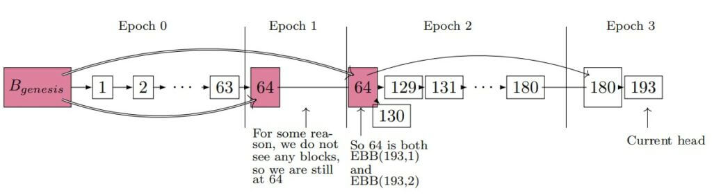
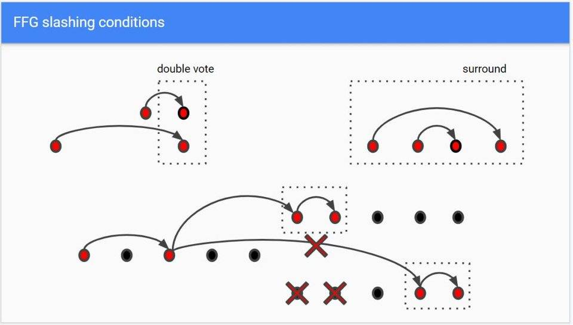
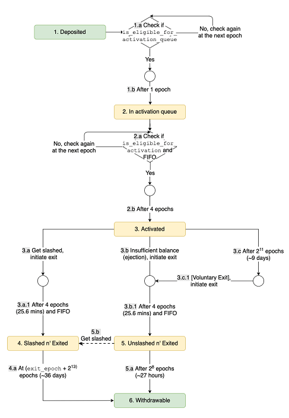

# 信标链信息调研

## 0x01. epoch和slot

每个epoch有32个slot，每个slot 12s，每个slot会最多产生一个信标链块和64个分片块。每个epoch会重新生成新的验证委员会。可能在一个slot中，被选中的区块提出者可能并没有提出新区块，或者此时该提出者并不在线，或者是该提出者提出了假的信息，因此被否决了。

## 0x02. validators和beacon chain

每个epoch随机选出，然后对提出的区块进行投票验证，验证结果似乎是放到分片区块头上，除了区块提出者，其他的验证者可以通过检举来获益。

信标链每个区块对验证者的地址，验证者的状态，签名以及链接到哪个分片做阐述。

## 0x03. 委员会成员根本不够节点

当前以太坊节点一共2000多个，但是分片之后，每个分片要求有独立的委员会，且至少128个成员，那么64个分片至少需要$2^{18}$个节点，明显不够用。此外，每个分片还有一个区块提出者，这个不能跟当前分片的委员会重合，但是可以与其他委员会重合，因此还应该加上$0-64$个节点。

**经过调查，实际能够参与验证的节点足够多，并不止2000多个。**

## 0x04. LMD GHOST分叉选择策略

选择拥有投票数最多的分叉链

Q：什么时候用？

在epoch的checkpoint处需要给出签名，来寻找主链，方便其他人同步。

## 0x05. Casper FFG和Casper CBC

CBC 的哲学是，验证节点对讯息签名，且若他们签了与他们先前的讯息相抵触的讯息，则他们必须提交一个「辩护（Justification）」以证明他们投票的新讯息与旧讯息相比之下有较多的支持，以取得「转换」的权利。

FFG中只要2/3的诚实节点认定了，敲定的区块就不能被推翻。只要1/3的验证者不同时翻供，就不会出现矛盾的敲定区块。

## 0x06. 远程攻击(Long-Range Attack)

攻击者可以将他们的押金从主链提领出来，并且形成另一条具有更多签名的攻击链，如此欺骗新加入的节点，让他们以为攻击链是一条主链。如果攻击链与主链分叉的时间点距离当前相当近，攻击链不会造成问题，因为验证者若在两条链上同时对两个互相抵触的讯息签名，则这个签名可以当成惩罚验证者的证据来没收押金；但是若分叉发生在很久之前（因此被称为远程攻击），攻击者可以取出押金以避免被没收

简单来说，就是很长时间之后，攻击者已经取出了押金，但是攻击者可以回溯到很长时间以前，此时的状态中，攻击者仍然有押金，存在一定的话语权，此时攻击者可以不考虑后果的制造分叉来追赶主链，来伪造数据。

解决该问题的方法很简单：1.**要求押金四个月才能提现**， 2. 不允许回溯四个月前的交易(==这里是之前的初始想法==)

实际的解决方案是这样：1. 设置检查点，检查点之前的区块不能够被回滚；2. 上下文感知交易，在构建交易时，在交易中记录前一个或前几个区块的HASH，将交易和区块联系起来，从而难以伪造。

## 0x07. 委员会对slot和epoch投票

**检查点：**每个epoch的第一个slot；如果某一个epoch的slot并没有区块，那么该epoch的检查点就是上一个最近的区块。例如下图中，block 64, 64, 180分别是epoch 1,2,3的检查点

一个epoch中的所有验证者都对检查点进行投票，并且投票前一个检查点，那么此时前一个epoch就被确认了，而当前检查点是被证明的。（==所以一个检查点会被校验两次，检查的方式就是2/3签名，可能要重新校验。现在最新看到的是大概率需要重新验证，因为提到在检查点时，所有验证者需要做两项工作，一个时justified，另一个是finalize==）

**Q1：**对slot投票并不是需要立刻投票，而是可以在之后再投，但是奖励会减少，但是这个之后可以多后面呢？

猜测可能是一个epoch结束，如果这个时候还没有投票，就可能算离线了，需要处罚，并且该slot如果未到2/3,就可能会处罚所有人，然后取消此时的区块。那么从这个角度来看，应该是等epoch结束之后,32个slot的区块一起进行上链，否则的话，如果某一个人没有及时投票，而slot的区块已经超过2/3，在下一个slot直接上链，那么没投票的人就失去了投票资格了。

**结合后面的不活动惩罚的4个epoch，这个猜想可能并不对，这里需要搞清楚最久离线多久可以签名，以及什么时候进行上链，肯定不会因为一个slot的区块没有完成就一直等着的**

**Q2：**这个两次是指什么呢？

>  An attestation has 32 slot chances for inclusion on-chain. This means a validator may have two attestations included on-chain in a single epoch. 

## 0x08. 奖惩机制

1. 验证者做出正确的验证可以获得奖励。信标链和分片关联的crosslink也会给奖励，然后就是前一个检查点的证实也会奖励。

2. 验证者会因为离线而未证明或者提供假证明受到处罚。

3. 假设一个验证者一年都勤勤恳恳的工作，它的收益是10%，那么如果不好好工作，会面临7.5%的处罚。即处罚大概是本可以获取到的收益的3/4，当然了，这里的收益也是获取不到的。

4. 故意错误投票将会被处罚金，这个罚金从0.5ETH到全部的质押金额。犯下错误的投票者至少被处罚1/32质押金，并被强制退出委员会，并打上“强制退出”标签。如果验证者在连续8192个epoch都离线，将会受到惩罚。系统还指定了额外的罚金，这个取决于作恶人的数量，其公式如下：

   ​                    $validator_{balance} * 3 *  fraction\_of\_validators\_slashed$

   也就是说，如果1/3的人都给出假证，那么这1/3的人的押金会被全部扣完。

5. 如果验证者正确举报其他恶意验证者，将会获得奖励。

6. 还存在一种不活动惩罚，如果区块在4个epoch都还没有最终确认，那么离线验证者的押金会随着时间的推移不断减少，来降低其占据的比例，以此重新让网络达到2/3.

## 0x09. 可处罚的行为

1. **提出多个区块**：区块提出者在同一个分片的一个slot中同时提出了两个或者更多区块。

2. **FFG投票错误问题**：总结来说，就是不能同时投多个区块；不能跳过某些epoch，同时对不相邻的epoch投票；对于同时被敲定的区块，应该跟随先敲定的分叉（==这个应该也是分叉的选择条件之一==）；这些可以反应在下图中：（==这里这么设置的原因需要考量一下==）

   

​	**注：举报者成功举报的前提是在大量的签名中找出矛盾的两个，这需要一些算法，值得研究。**

## 0x0A. 验证者激活和退出

验证者需要存32个ETH，并经过两轮验证，每个epoch只会正式激活4个验证者，防止验证者变化的太剧烈。激活成功后有两种退出方式，第一是自愿退出，这种情况需要节点自从加入进来，累计服务了2048个epoch(大约9天)[==注意：这里还有文章说是256个epoch，最好还是查看代码确认==]之后才能退出。第二种是强制退出，这种分为两种情况，其一是长时间离线，罚款导致余额低于16ETH；其二是做出虚假证明，其实就是站在了少数的1/3那边，就会被直接踢出。==被强制退出的验证者再有没有机会参与了==

不论是如何退出，退出的过程中都有4个epoch的延迟。退出之后，自愿退出的诚实节点需要27小时来取出押金，而被强制退出的节点需要8192个epoch，大约36天来取出押金。

下面给出了这个过程的示意图：

## 0x0B. 一些概念

1. 取钱密钥和签名密钥

   签名密钥被验证者用来签署验证证明，取钱密钥被用来取钱。前者一直公开，后者一直被链下存储。

2. RANDAO

   一个伪随机分配各个验证者到各个委员会的机制

3. 权重值的上限是32ETH，也就是说32个ETH和33个ETH的权重一样大，（==但是64会不会一样，目前没有看到相关定论。==）
4. inactivity leak在4个epoch还没有达到确定状态时出来处罚不投票的验证者，这个处罚随着时间的推移，直到确认为止。

## References

1. [信标链总述](https://ethos.dev/beacon-chain/)

2. [分叉的选择和区块的证明和敲定](https://www.chainnews.com/articles/549612473461.htm)

3. [Casper FFG和Casper CBC](https://ethfans.org/zengmi/articles/36702)

4. [长程攻击](https://www.jianshu.com/p/c0cbd6937be5)

5. [ETH 2.0一些机制的解读 part1](https://medium.com/stakefish/deeper-dive-into-ethereum-2-0-part-1-93c475a18735)

6. [ETH 2.0一些机制的解读 part2](https://medium.com/stakefish/deeper-dive-into-ethereum-2-0-part-2-90500eb06743)

7. [验证者的生命周期，即存储的一系列细节](https://notes.ethereum.org/7CFxjwMgQSWOHIxLgJP2Bw#A-note-on-Ethereum-20-phase-0-validator-lifecycle)

   
