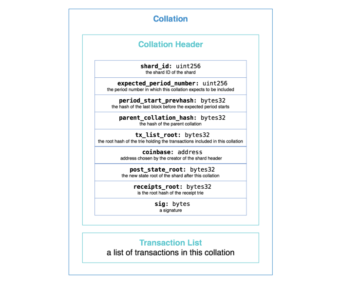
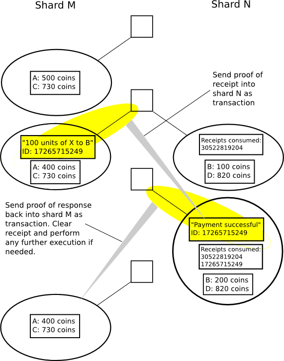
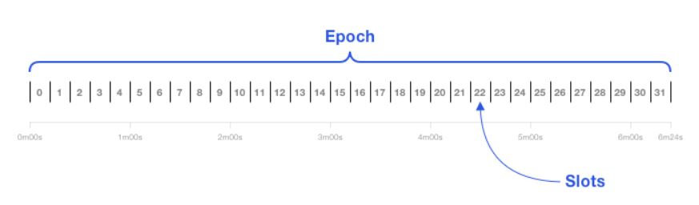

# Sharding学习笔记

## 0x01. 目标

并行处理交易，提高整体吞吐量，只需要足够的节点去验证交易即可，而不需要大家都去验证一遍。分而治之，这是一种扩容方案。

## 0x02. 分片的基本思想和设计

**思想**：将所有的状态和历史信息分散保存

**基本设计：**在每一个时隙中，对于每一个分片i，随机选择一个区块生成者，然后假设再找100个验证者，然后区块头和至少2/3,这里是67个人的成功验证的签名被记录到信标链中。

在这样一个设计里面就有4种节点存在：

1. 超级全节点：保存信标链和每个分片链的所有数据
2. 高级节点：保存信标链数据
3. 单分片节点：保存信标链数据，也保存其关心的某一个分片
4. 轻量节点：只保存信标链的头

**校验器和校验块**

每个分片上都有很多校验器，这些校验器的功能是生成校验块，校验块是对当前分片状态和交易的描述。每个校验块都有一个校验头，包含下面的信息：

- 校验块所对应的分片信息，例如到底是哪一个分片
- 所有交易生效前，该分片的状态信息
- 所有交易生效后，该分片的状态信息
- 来自分片上2/3校对器的签名，证明没问题(==这里的问题是怎么收集这2/3的签名==)

然后超级全节点来汇总所有分片中的交易块，验证处理其中的交易，并更新所有分片新的状态。区块有效需要满足下面的几个条件：

- 校验块中的交易有效
- 校验块中较以前的状态与之前保存的最新状态一致
- 交易后的状态与校验头指定的状态一致
- 校验块被2/3签名

> 到目前为止，我理解中的分片就是各个分片同时处理新的交易，然后在分片中上链（这里上链的块叫做校验块），并由委员会根据PBFT给出证明，上交给超级全节点，然后超级全节点进行验证，并将一些信息记录在信标链上。

## 0x03. 分片设计的一些挑战

1. **单分片控制问题**

   如果攻击者掌握了验证一个区块的大多数的验证者，来阻止正确数据的上链或者干脆生成不正确的区块怎么办？(==这里似乎可以通过随机选择来解决，但是如果攻击者基本控制了所有节点就没办法了，毕竟分片链规模相对较小==)

2. **状态更新问题**

   上述问题可以通过随机抽样来尽量避免，但是这样的话，验证者不能及时计算状态根，因为他们不能及时获得每个分片实时更新的状态。（==这里的状态根指的是MPT root？分片之后还是整体维护包括账户信息在内的状态根吗？在这种情况下，最新状态根应该在最新更新的分片区块上，直接去信标链上找最新的不就可以了吗？==）

3. **欺诈攻击**

   如果确实发生了攻击，如何通知所有节点去验证或者说拒绝呢？（==这一点应该是在上链之前讨论，如果此时攻击者掌占据大多数，可以提交虚假证明，但是实际上有其他少数节点能发现该问题，这个时候应该提供一种方式来进行申诉，比如以信誉担保，那个区块有问题，请求重新构建投票组之类的。==）

4. **跨分片通信**

   如何安全的进行跨分片通信（==简单的通过信标链吗？这里后面还给出了一个收据模式==）

   收据在收据 Merkle树中存储，可以被轻易验证。

   

5. **数据可用性问题**

   官方解释是校验结果中的数据丢失。（==这种情况并没有理解==）

   补充：现在的理解是状态分片中，某一个状态仅仅保存在每一个分片中，一旦那个分片出现问题，或者直接离线了，那么很多交易就没有办法进行验证。一个好的解决办法是进行备份。（2021/11/1）

6. **超二次分片**

   在分片上再次建立分片，这是之后打算实现的，不过还早

## 0x04 分片技术的关键

**VMC（验证管理合约）**

1. 股权抵押

   验证者需要质押以太币，如果出现行为不端就会罚款

2. 伪随机抽样

   使用最近的区块hash作为种子来随机抽取验证者。验证者首先抵押一定的以太币（32个），然后他们的验证码地址将会被存储在一个全局的验证池列表中。验证者接着会被抽出在一个epoch内仅仅为一个分片工作。

   

3. 校验头验证

   VMC提供addHeader函数来进行链上的快速校验，并将正确的校验头hash记录下来。

4. 跨分片通信

   用户可以在信标链上创建一个收据，然后分片链上的用户可以生成一个receipt-consuming交易，带有收据号来进行花费。

5. 链上管理

   VMC的验证小组可以进行链上的投票，即决定那2/3

## 0x05. 分片的类型

1. 网络分片

   抽取节点形成分片

2. 交易分片

   按交易进行分类，基于UTXO的频繁跨分片通信比较麻烦，基于账户的要好很多

3. 状态分片

   只保存整个网络的部分状态，感觉以太坊当前描述的分片就是这种格式

4. 计算分片

   把所有的计算工作都集中在一个子集(一个或多个分片上)==不是很懂它的意义???==

## 0x06. 其他

- 每个epoch, 每个分片只会有一个正确的校验块
- 正常主链的选择都是选择最长链，但是分片中，最长链的选择先看对应信标链中哪个是最长的，最长信标链对应的分片不论长短都是最长的。如果信标链一样长，再去看分片链谁更长。
- 51%攻击和1%攻击
- 参考文献4给出了当前对分片的初步设计方案源码

## References

1. https://eth.wiki/sharding/Sharding-FAQs
2. https://ethfans.org/posts/how-to-scale-ethereum-sharding-explained
3. https://medium.com/@icebearhww/ethereum-sharding-and-finality-65248951f649
4. https://github.com/ethereum/sharding/blob/develop/docs/doc.md
5. https://medium.com/@tokenroll/%E5%88%86%E7%89%87-%E5%88%86%E8%80%8C%E6%B2%BB%E4%B9%8B-%E6%97%A0%E9%99%90%E6%89%A9%E5%B1%95-%E5%8C%BA%E5%9D%97%E9%93%BE%E6%8A%80%E6%9C%AF%E5%BC%95%E5%8D%B7%E4%B9%8B%E5%9B%9B-d835f0a2f738
6. https://zhuanlan.zhihu.com/p/74583010